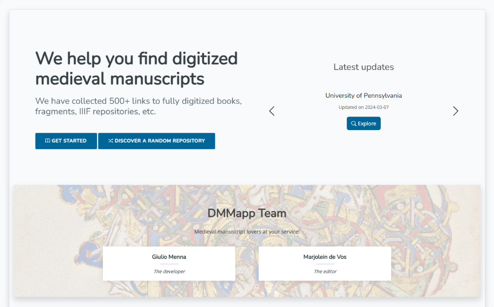

# Digitized Medieval Manuscripts app (DMMapp)

---

Welcome to the Digitized Medieval Manuscripts app (DMMapp) repository! This project is designed to simplify access to
digitized medieval manuscripts: it provides a user-friendly interface for browsing and searching through a vast
collection of digitized repositories and providing links to the collections.

Whether you're a developer looking to contribute to the app or simply want to submit data, or you're simply curious
about how it all works, you can learn all there is to know about how to use and contribute to the DMMapp by visiting
[our documentation](https://sexycodicology.github.io/DMMapp-Digitized-Medieval-Manuscripts-app/).

and

---

## Questions and help

Check out
the [Discussions page here on GitHub](https://github.com/SexyCodicology/DMMapp-Digitized-Medieval-Manuscripts-app/discussions)
if you have technical questions, or head to
the [Digitized Medieval Manuscripts app website](https://digitizedmedievalmanuscripts.org/) to find all the channels
where you can reach us.
